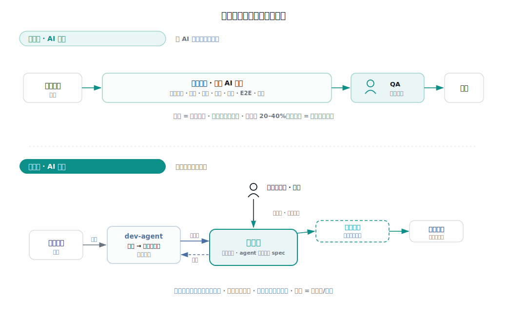
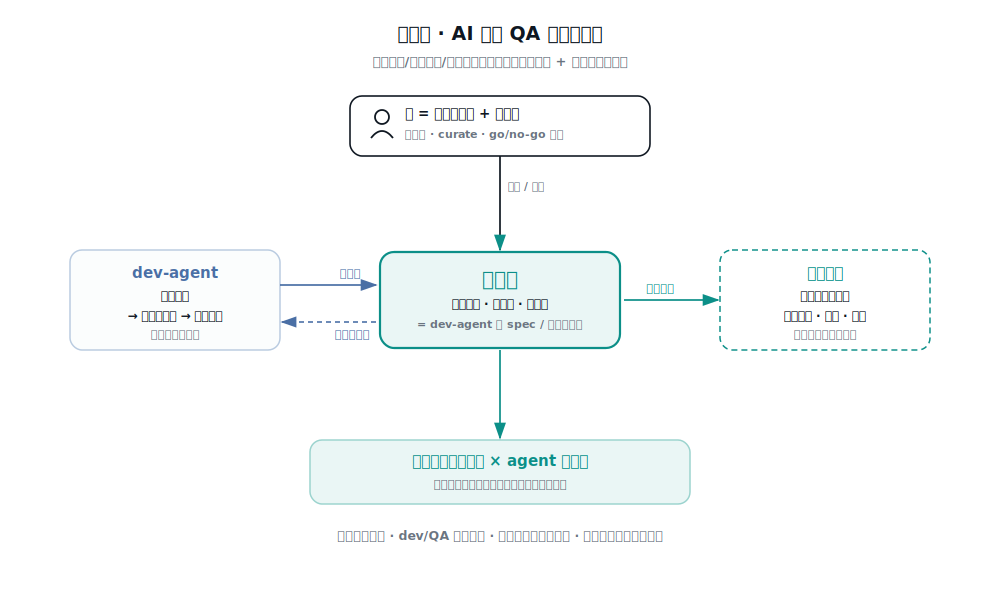

# 两种范式：AI 增效 vs AI 原生

把 AI 用进质量工作，有两种根本不同的做法。它们不是"浅"和"深"的区别，是**两个方向**。这篇把区别摆到能一眼看见的程度。

## 先讲一个历史（电力的教训）

电动机 1890 年代就有了，但工厂生产率**直到 1920 年代才跳升**——中间隔了近 30 年。

为什么这么久？因为一开始，大家只是把电动机装在原来蒸汽机的位置上：一根中央驱动轴、皮带分动、厂房还是围着那根轴排的。**换了动力源，没换工厂。** 这就是著名的"生产率悖论"——到处是电，就是不在生产率统计里。

真正的革命是有人问了另一个问题：既然电可以**分布式、小型化**，每台机器自己装个小马达，我为什么还要围着一根驱动轴排厂房？于是厂房被**重新设计**——按工作流排布、机器独立驱动。这才带来 2–3 倍的跃升。

**教训不是"用上新技术"，而是：当某样东西的成本塌缩到接近零，你要重新设计围绕它的一切。**

AI 进入质量工作，正站在同一个路口。

## 同一次代码改动，两种流法

**方向一 · AI 增效**：保留既有工序，在每一步塞进 AI 让它更快更全。提测仍是一个时点，质量靠末端把关。这是把电动机拧在蒸汽厂房上——真实有效，但天花板被旧流程的形状锁死，增益大约 20–40%。

**方向二 · AI 原生**：既然"读代码 / 生成用例 / 跑验证"都趋于免费，就不再问"怎么把 QA 做得更快"，而问"当这些免费了，QA 到底该是什么"。围绕**判准**重新设计整条流。

## 逐维对比

| 维度 | 方向一 · AI 增效 | 方向二 · AI 原生 |
|------|-----------------|-----------------|
| 出发点 | 让既有工序更快更全 | 成本塌缩后，重新设计围绕它的一切 |
| 提测 | 一个把关时点 | 溶解为**持续验证**，随每次改动发生 |
| QA 角色 | 测试执行者（AI 辅助） | **判准工程师 + 判断担责者** |
| 核心资产 | 测试用例集 | **判准库**（agent 可消费的 spec） |
| dev / QA 交接 | 提测交接 | 对判准生成，交接**消失** |
| 质量从哪来 | 末端把关拦住 | 生成即达标 + 持续验证 |
| 度量 | 阶段逃逸率、效率 | **判准覆盖率 × agent 遵守度** |
| 增益量级 | 约 20–40% | 数量级 / 重构 |
| 主要风险 | 生产率悖论：白装 AI，形状没变 | 判准不足则空转 |

一句话：**方向一让同样的活变便宜；方向二改变了这些活是什么。**

## 为什么是"判准"成了中心

AI 让哪些东西趋于免费——读懂代码、生成场景、驱动环境验证。哪些**没有**趋于免费——判准（什么才算对）、担责、真实世界访问、组织隐性知识（见《独立深度地图》）。

推论很硬：**当执行侧全面变便宜，唯一的稀缺资源是「判准 + 判断」。那么整个 QA 就该围绕『生产、沉淀、拥有判准』重新设计，而不是围绕『执行测试』。**

在这个模型里：

- **判准库是中心，也是复利的护城河**。它不是文档，是"什么算对"的可执行编码——dev-agent 拿它当 spec，门禁拿它当依据。它越厚，整套系统越准。
- **人从执行者翻转成判准工程师 + 担责者**。人类不可替代的贡献只剩两件：编判准 / curate 判准库，和 go/no-go 签字。其余全交给 agent。QA 从大执行团队，变成小而高杠杆的判准与判断团队。
- **dev/QA 交接靠"对判准生成"来消掉**。dev-agent 生成代码后立即对判准自检、不过就改——**生成即达标**。踩出的新判准回流判准库。于是"提测"作为交接事件消失了。
- **验证是持续属性，不是时点**。每次改动即触发对判准的验证，没有独立的提测闸口。
- **度量也变了**：不再主要看某阶段的逃逸率，而看**判准覆盖率**——系统的正确性有多少已经被编码成可消费的判准。

## 这两个方向不是二选一

最重要的一句：**方向一是方向二的"布线"。**

电力那教训里，悲剧的一方是"装了 20 年电动机、厂房没改、生产率纹丝不动"。翻译过来：**如果把 AI 增效当成终点（只让现在的 QA 更快），就是把电动机拧在蒸汽厂房上，迟早撞上生产率悖论。**

但方向一里有一样东西，恰恰是方向二的内核：**会回流、会复利的判准库**。每一次提测流水线跑完把判准写回去，都是在攒方向二所围绕的那块皇冠资产。

所以真正的战略纪律只有一条：**让方向一在复利方向二的资产（判准、判断的编码化），而不只是在优化旧形状。**

- 如果你的 AI-QA 只是把同样的报告出得更快、什么都没沉淀——那是电动机拧在蒸汽机上。
- 如果每一跑都在加厚判准库、并且你在盯着"哪一刻成本结构允许你溶解掉某个阶段、某个交接"——那方向一就是通往方向二的匝道。

## 落地路线（从今天到方向二）

1. **今天**：跑方向一的提测流水线（`/test-intake`），但把**判准回流**当头号 KPI 经营——不是"跑了多少次"，是"判准库厚了多少、覆盖了多少正确性"。
2. **积累**：判准库长到能让 dev-agent"生成即对判准自检"。这一步够了，dev/QA 交接就开始能溶解。
3. **重构**：把提测从"时点"改成"每次改动的持续验证"；QA 编制从"执行"转向"判准工程 + 判断担责"；度量从逃逸率切到判准覆盖率。
4. **稳态**：方向二——质量是判准覆盖率的函数，人只在判准与判断层，执行全部由 agent 承担且持续发生。

> 以效率提升和质量保证为基石看：方向二在两条上都赢——效率上没有交接、验证持续；质量上判准覆盖率复利增长。但它只能**长出来**，长的方式，就是把方向一每一跑都用来加厚判准库。
