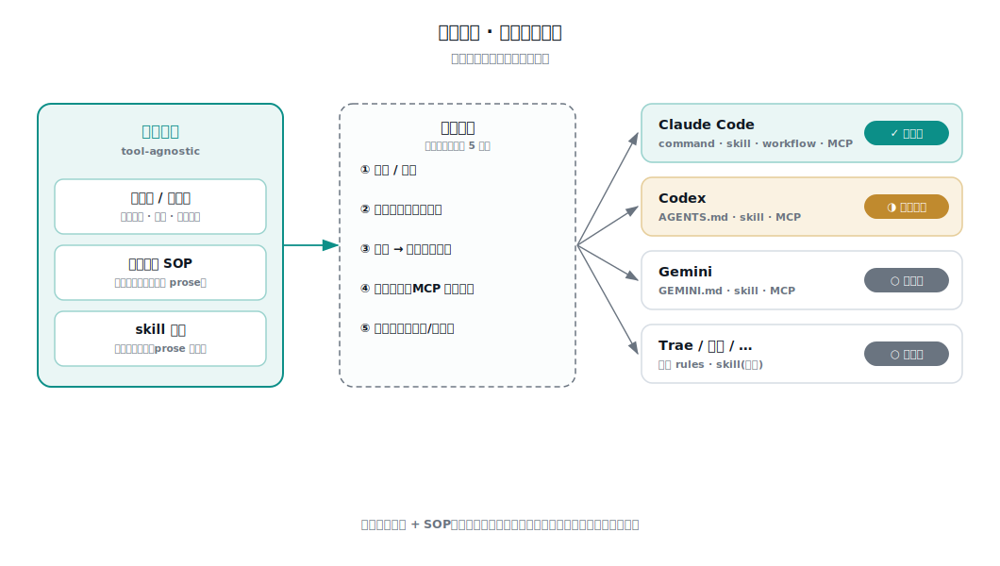

# 工具可移植性 · 引擎适配层

这套东西绑死某个 AI 编码工具吗?——**不绑。真正的资产工具无关,绑的只是一层很薄的外壳。** 这一篇把可移植性讲清楚,它本身也是一个对外主张:**不锁定工具。**

## 一个架构决定

**唯一真源(tool-agnostic)**:判准库/经验层 + 工具无关的编排说明书(SOP)+ 各阶段做法(skill 的 prose 指令)。这是全部价值所在,不依赖任何工具。

**适配壳(thin adapter)**:把真源塞进某个工具的构件里、跑起来。很薄——它不含判断、不含判准,只做"翻译"。

换工具 = 换壳,真源不动。谁家工具强,就用谁的驱动器。

## 分三层看,哪些绑、哪些不绑

| 层 | 绑不绑工具 | 说明 |
|----|-----------|------|
| **方法论**(深度地图 / 两种范式 / 研发周期) | ❌ 完全无关 | 纯思想,任何工具、甚至没工具都成立 |
| **经验层 / 判准库** | ❌ 基本无关 | 抽象过的 markdown 知识(写的是「工作项系统」而非某具体系统)。任何能读文件的 agent 都能消费 |
| **引擎** | ◑ 大部分已是跨工具标准 | 真正绑 Claude Code 的只剩 command + workflow 两种壳;skill 与 MCP 都已是跨工具开放标准 |

引擎拆开看,只有**两处**是真正的 Claude Code 专有壳:
1. **command**(`/test-intake` slash 命令 + 人工闸口)—— 各家触发机制不同,要重映射。
2. **workflow**(多 Agent 并行扇出)—— 最工具特有,别家大多退化为串行。

另外两块其实**已经跨工具,不用重写**:
- **skill**:`SKILL.md` 现在是**开放标准**(agentskills.io,源自 Anthropic、现由社区维护),Codex / Gemini / Cursor / Copilot 等 30+ 工具都支持。**同一个 skill 目录在 `~/.codex/skills/` 与 `~/.claude/skills/` 之间直接拷,一字不改。**
- **MCP**:调工作项系统/代码平台/浏览器的协议,Codex、Cursor 等都支持,配置照搬。

所以"薄适配壳"比想象的更薄——**真正要重写的只有 command 编排 + workflow 并行两处**,skill 和判准库直接搬。

## 适配契约:每个新壳要映射的 5 件事

把引擎搬到一个新工具,不是重写逻辑,是把这 5 个接点映射到该工具的机制:

| # | 接点 | Claude Code 里是 | 移到新工具 |
|---|------|-----------------|-----------|
| ① | **触发 / 命令** | slash `/test-intake` | 该工具的自定义命令 / prompt / 别名 |
| ② | **阶段编排** | command 主会话串七环 | 该工具的主指令文件(如 AGENTS.md)顺序执行 |
| ③ | **并行扇出** | workflow 多 Agent 并行审 | 多数工具无对等物 → **退化为串行**(慢一点,功能在) |
| ④ | **工具调用** | MCP(TAPD/GitLab/Playwright) | 支持 MCP 就照搬(Codex 等都支持) |
| ⑤ | **人工闸口** | command 里挂起等确认/覆盖 | 该工具的交互暂停点 |

真源(判准库 + SOP)**一个字都不用改**;**skill 因为是开放标准,也直接拷**。要动的只有 ① ② ③ ⑤ 里跟"命令/编排/并行"相关的那层薄壳。

## 各工具可行性

内核都能搬;差别在外壳怎么写:

- **Claude Code** —— ✓ 已就绪(参考实现,`02-引擎/`)。
- **Codex** —— ◑ 本次做了移植样例(`02-引擎/adapters/codex/`)。因为 Codex **没有自定义 slash 命令**,编排改由 `AGENTS.md` 承载 + 自然语言触发;五个 **skill 直接拷进 `.codex/skills/`**(SKILL.md 跨工具通用);MCP 写进 `config.toml` 的 `[mcp_servers]`;并行审退化为串行。
- **Gemini(CLI / Code Assist)** —— ○ 可扩展:`GEMINI.md` + skill(同标准)+ MCP,照 Codex 思路重写编排壳。
- **Trae / 智谱(GLM·CodeGeeX)/ 其他** —— ○ 可扩展:各家有自己的 rules / agent 机制,skill 走开放标准可直接拷,编排壳按各家重写,并行大概率退化为串行。

## 这正是"方向二"的必然推论

《两种范式》里那句话——**真资产(判准库)工具无关,引擎只是某工具的驱动器**——就是可移植性的根据。工具会换,判准库是你复利的护城河。所以架构上就该:**唯一真源 + 每工具一层薄适配壳**,而不是把价值焊死在某个工具里。

> 现状如实讲:今天拿去就能跑的是 Claude Code;Codex 有了可安装的移植样例,但因为无法在本环境实跑 Codex,样例里凡涉及 Codex 具体机制处都标了"需 live 验证"。其余工具是"可扩展",壳还没写。
