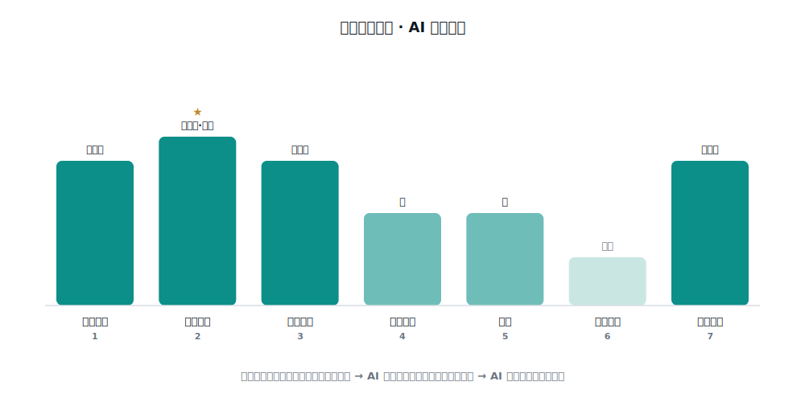
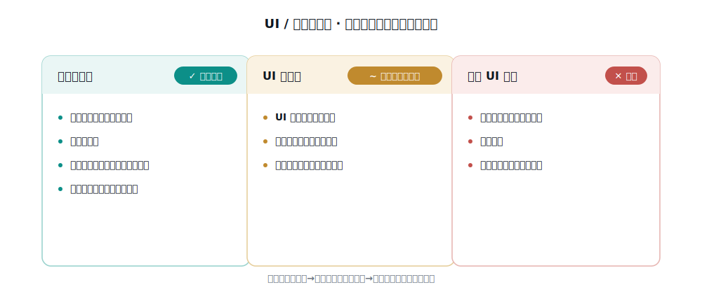
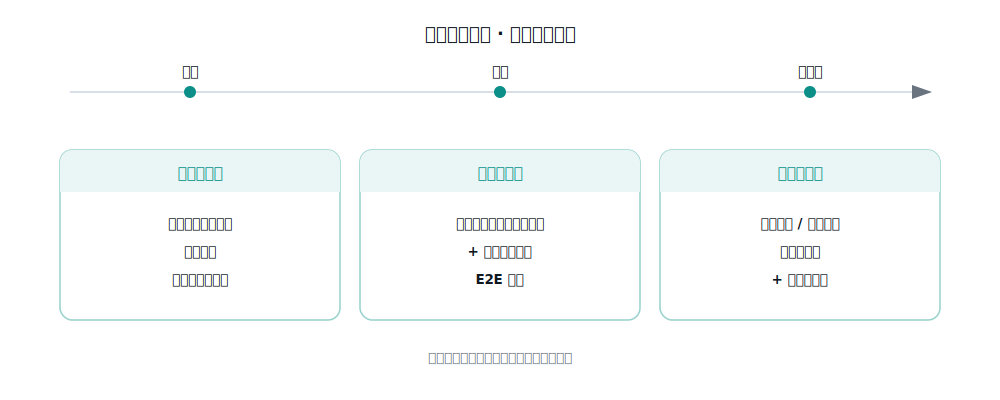

# 研发周期框架 · AI 在每一环能扎多深

这是方法论的落地视角：把研发全周期摊成七环，每环回答三件事——传统怎么做、AI 能做什么、AI 做不到什么。深度判断的依据见同目录的《独立深度地图》：AI 在 QA 里的深度由三个变量决定——可机械化程度、判准（oracle）是否可得、是否能用硬信号验证；反向受制于真实世界访问、组织担责、隐性上下文。

> 本文只讲通用框架，不含任何具体项目的数字与实现。某个团队按这套框架落地后的真实数据，属于该团队的内部实现，不在方法论层。

## 七环

| 环 | 传统怎么做 | AI 能做 | AI 做不到 | 深度 |
|----|-----------|--------|----------|------|
| 需求质量 | 需求评审、三方会谈、验收标准澄清 | 扫歧义、补遗漏维度、草拟验收标准 | 判断真实意图、裁决冲突、担责 | 强增强 |
| 计划与用例设计 | 用例设计技术、测试数据设计 | 多维度用例、消费判准定预期、生产模式回归 | 提供缺失的判准本身 | 强增强（最深） |
| 提测把关（静态） | 静态分析、代码评审、走查 | 白盒对照清单审、对抗复核去误报、分级 | 定夺"该不该硬拦"这类担责裁决 | 强增强 |
| 测试执行 | 冒烟/功能/集成/E2E，手工与自动化 | 驱动环境、接口断言、留证 | 自主判定"什么算对"（需判准） | 中 |
| 回归 | 回归范围选择、变更影响分析 | 影响面驱动的范围选择 | 无判准时的结果正确性判断 | 中 |
| 上线准入 | UAT、发布就绪、Go/No-Go | 聚合证据、给准入信号 | 放行担责 | 辅助 |
| 线上质量 | 生产监控、问题分析、右移 | 拉数据算逃逸率、缺陷模式回流经验 | 主动探测与根因担责 | 强增强 |

一条主线：**AI 扎得最深的地方，是可机械化、判准可得、能用硬信号验证的环节——集中在提测中段（用例设计、静态评审、影响面/回归）。** 越靠近"需要担责、判准缺失、依赖组织隐性知识"的环节，AI 越浅，人越不可替代。

## 要不要做 UI / 接口自动化

不是一刀切，按"判准是否稳定可得"分三类：

- **接口自动化——建，优先。** 接口有明确契约，判准可得、稳定、维护成本低。优先覆盖缺陷最密集的核心模块，沉淀成可重复跑的回归资产。
- **UI 自动化——只做主链路冒烟。** UI 变动频繁、判准弱，广覆盖的维护成本会吃掉收益。只对少数关键主流程做冒烟级用例。
- **全量 UI 脚本——不建。** 维护成本随功能线性增长、收益递减，最终无人维护、集体失效。

## 上线怎么回归

回归不是一件事，是分层的：

- **提测前回归**：每次提测，变更影响面驱动的范围回归（引擎内已有）。
- **上线前回归**：跑接口回归集（覆盖高频模块）+ 关键业务链路的 E2E 冒烟。
- **上线后回归**：生产只读/幂等探针跑一遍关键接口，配合逃逸率复测。

三层各司其职，避免全量回归拖垮节奏，又不漏关键链路。
