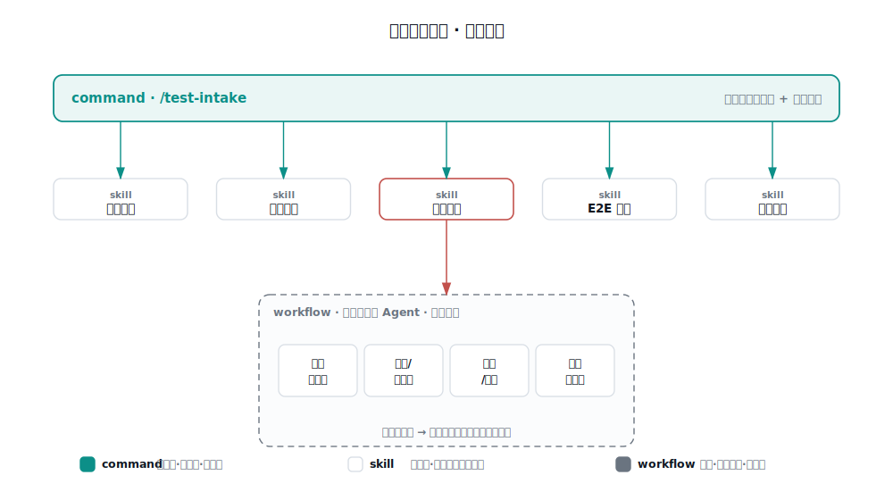

# 引擎

引擎定义流程怎么走、调什么工具、产出什么格式。它跨项目基本不变，差异性全落在经验层。这一层由一个顶层命令、五个阶段 skill、一个并行评审 workflow 组成。

## 流程框架

```
输入：① MR链接 或 仓库+分支   ② 工作项号   ③ 研发设计文档（可选）
      ④ 测试环境 URL / 租户 / 账号（E2E 阶段用）
   │
   ▼  顶层编排命令（主会话，工具全程可用）
   │
   ├─ 0  入参归一 + 判目标仓 + 加载经验（platform + projects/<仓> + 阶段规则）
   ├─ 1  需求解析      工作项系统 → 需求/缺陷要点、验收标准、附件
   ├─ 2  变更提取      改动文件·接口·页面 + 路由索引反查影响面/回归范围
   ├─ 3  用例生成      多维度用例（功能/异常/边界/权限/多租户/回归）→ 写用例库 + 关联
   ├─ 4  代码评审      问题清单 + 风险分级 + 门禁裁决（自动，可覆盖）→ 回写评论
   ├─ 5  门禁          通过？── 不通过 ──► 停，回写，等修复
   ├─ 6  部署          人工闸口（部署后告知就绪），或接运维平台自动化
   ├─ 7  E2E/接口验证  驱动真实环境 + 接口断言 + 截图 → 回写评论
   └─ 8  汇总 + 度量    整体结论 → 汇总评论 + 度量落库 + 询问是否沉淀经验
```

## 三种编排形态，各司其职

以 Claude Code 为例，三种东西不要混用：



| 形态 | 文件 | 跑在哪 | 用途 | 本包里 |
|------|------|--------|------|--------|
| command | `commands/*.md` | 主会话 | 串流程、人工交互、调工具 | 顶层 `/test-intake` |
| skill | `skills/*/SKILL.md` | 主会话 | 某类任务的标准做法 | 五个阶段能力 |
| workflow | `workflows/*.js` | 后台，派生子 Agent | 并行扇出、多 Agent 编排 | `code-review-parallel` |

主干用 command 而非 workflow，是因为它本质是"顺序 + 人工闸口（门禁覆盖、部署就绪、回写前确认）+ 大量工具调用"。workflow 在后台自动跑，无法自然挂起等人交互，工具调用也是主会话最稳。workflow 的正确位置是阶段内"不碰工具、纯读本地代码、可扇出"的重活——典型就是代码评审的多维并行审查：多个维度并行审，每条发现再对抗式复核去误报。

## 五个 skill

| skill | 阶段 | 做什么 |
|-------|------|--------|
| `mr-change-extract` | 2 | 提取改动，反查影响面与回归范围 |
| `testcase-generate` | 3 | 生成多维度用例，消费判准库定预期 |
| `code-review-gate` | 4–5 | 白盒评审、分级、按签核基线做门禁裁决 |
| `e2e-verify` | 7 | 驱动真实环境、接口断言、留证 |
| `qa-metrics` | 8 | 度量落库 |

## 门禁裁决


严重度不逐次主观判断，而是查 `03-经验层/review-rules.md` 第五节的已签核基线。任何裁决 QA 可覆盖放行或覆盖拦截，覆盖记理由。

## 部署可插拔

阶段 6 现为"人工确认就绪"的挂起点。接运维平台后，只把这一步换成"调工具触发部署 + 轮询就绪"，前后阶段不动。

## 边界

全程只读代码、评论工作项、写用例，不提交业务代码、不动主线分支、不 commit/push。经验层的自我迭代也只改本地。
