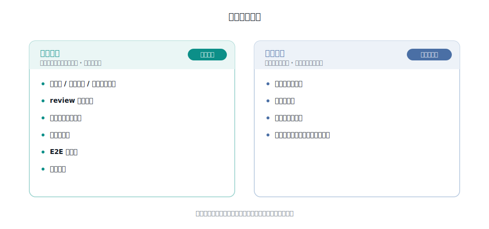

# 提测质量度量

> 把度量落进流水线：每次 `/test-intake` 跑完自动记一条，攒出趋势；结果指标接工作项数据后可对历史回填基线。工具：[`tools/qa-metrics.py`](../../tools/qa-metrics.py)。

---

## 两类指标



**过程指标（现在就能采）** —— 流水线每次运行自然产出，落库即得，不依赖外部数据：
用例数 / 维度覆盖 / 可自动化占比、review 各级别数、对抗复核去误报数、门禁拦截率、E2E 通过率、验证周期。

**结果指标（需工作项数据）** —— 依赖 工作项系统 状态与缺陷数据，见文末口径。可对历史回填出**落地前基线**，无需等待。

---

## 数据文件

- `intake-runs.jsonl` —— 真实运行记录，每行一条 JSON（`/test-intake` 阶段 8.5 追加）。
- `example-runs.jsonl` —— 两条示例，仅作 schema 参考，不参与统计。
- `dashboard.html` —— 过程指标看板（`qa-metrics.py dashboard` 生成，浏览器可看）。

## 记录 schema（一行一条）

```jsonc
{
  "run_at": "2026-07-14T10:30:00+08:00",   // 必填：ISO 时间
  "tapd_id": "<工作项号>",                     // 必填：工作项号
  "repo": "<业务仓>",                 // 必填：目标仓
  "branch": "fix/xxx",
  "mr": "<MR号>",
  "testcases": {
    "total": 24, "p0": 6, "p1": 12, "p2": 6,
    "dimensions": ["功能","异常","边界","权限","多租户","回归"],
    "automatable": 9
  },
  "review": {
    "verdict": "有风险",                     // 通过 / 有风险 / 不通过
    "blocker": 0, "major": 2, "minor": 3, "info": 1,
    "parallel": true,                        // 是否用了并行评审 workflow
    "false_positive_removed": 2              // 对抗式复核剔除的误报数
  },
  "gate": {
    "auto": "有风险",                        // 自动裁决
    "final": "放行",                         // 最终（人可覆盖）：放行 / 不通过 / 拦截
    "overridden": true, "override_reason": "..."
  },
  "e2e": {
    "ran": true, "total": 9, "passed": 8, "failed": 1,
    "blocked": 0, "manual_needed": 3
  },
  "durations_sec": { "total": 1820, "review": 340, "e2e": 600 },
  "outcome": { "submitted": true }
}
```

字段尽量填，缺了不报错（统计时按缺省处理）。只有 `run_at / tapd_id / repo` 必填。

## 用法

```bash
# 追加一条（/test-intake 阶段 8.5 自动调用；也可手动）
echo '<一条 JSON>' | python3 tools/qa-metrics.py emit

# 出 Markdown 周报
python3 tools/qa-metrics.py report

# 生成 / 刷新 HTML 看板
python3 tools/qa-metrics.py dashboard
```

---

## 结果指标口径（接工作项数据后产出）

这 4 个指标只从流水线日志得不出，需接 工作项系统。工作项系统 有历史，可**回填落地前基线**：

| 指标 | 口径 | 数据源 |
|------|------|--------|
| 提测一次通过率 | 提测后未被打回、直接通过的次数 ÷ 总提测次数 | 工作项系统 状态流转（提测→通过/打回） |
| 提测打回率 | 1 − 一次通过率 | 同上 |
| 提测到通过周期 | 「测试通过」时间 − 「提测」时间 | 工作项系统 状态时间戳 |
| 线上缺陷逃逸率 | 线上标记缺陷数 ÷ 总缺陷数 | 工作项系统 缺陷 + **线上缺陷需打统一标签** |

> ⚠ 逃逸率有一个前置：需团队约定**给线上发现的缺陷在 工作项系统 打一个统一标签/字段**，否则算不出。这是唯一需要流程配合的一点。
>
> 接入细节见 `python3 tools/qa-metrics.py baseline --help-only`。

---

## 待办

- [ ] 接 工作项系统 数据源，实现结果指标 + 历史基线回填（需 工作项系统 token / MCP）
- [ ] 团队约定线上缺陷打标（逃逸率前置）
- [ ] 把本套度量沉淀为可复用模板
