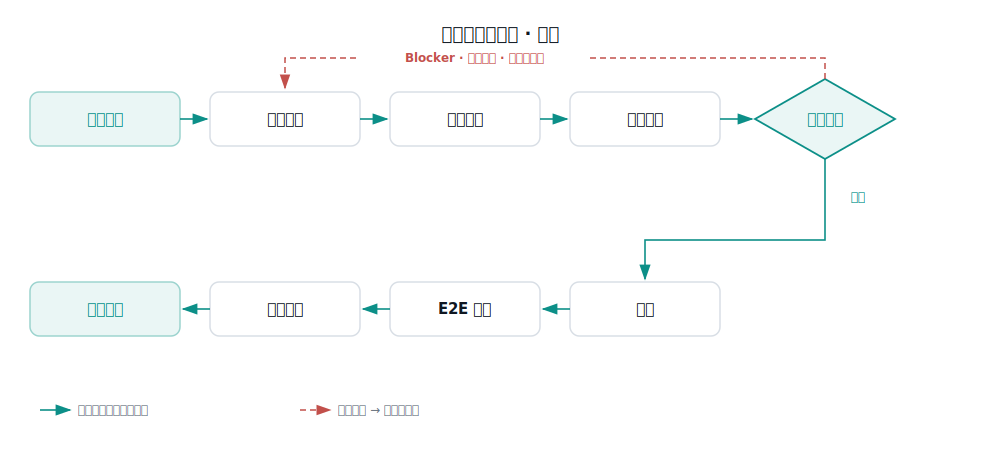
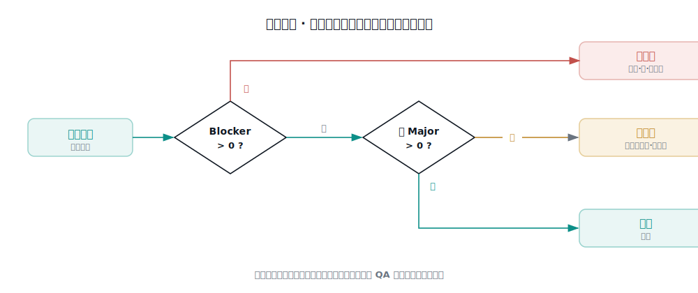

# QA 使用手册

这份手册给**日常做提测验证的 QA**。读完你能:用一条命令跑完一次提测把关,知道每一步该做什么、哪里该你拍板、怎么读结果、怎么让它越用越准。

> 想把这套流水线**装进一个新项目**的人,看《落地手册》——那是配置文档,一次性的。本手册只讲**怎么用**。

---

## 一、它是什么(30 秒)

研发提测后、测试通过前,有一段每次都要做的固定活:读懂改了什么、想清楚测什么、审代码、把不该上线的挡住、部署、跑验证、把结论写回工作项系统。

`/test-intake` 把这段活用 AI 编排成**一条命令**跑完。你只管起这条命令,**中间该你决策的地方它会停下来等你**。



---

## 二、用之前:确认三样齐了

1. **工具就绪**——这个仓已配好 AI 代理(如 Claude Code)和它的命令、skill;工作项系统 / 代码平台 / 浏览器自动化能调用。(这一步由装配的人一次性搞定,不用你操心;不确定就问装它的人。)
2. **提测信息**——你手上有 **MR/PR 链接**(或 仓库+分支)和 **工作项号**。
3. **测试环境**(要跑 E2E 才需要)——环境 URL、租户、账号,你能登进去。

---

## 三、怎么起 —— 你只记这一条

```
/test-intake  MR=<MR链接>  ISSUE=<工作项号>
```

要它顺带把 E2E 也跑了,把环境补上:

```
/test-intake  MR=<MR链接>  ISSUE=<工作项号>  ENV=<测试环境URL>  TENANT=<租户>  ACCOUNT=<账号>
```

> 参数不用死记 `key=value` 的格式。把 MR 链接、工作项号、环境信息**一股脑贴上去**,它自己认。缺 MR 或工作项号,它会反过来问你。

---

## 四、它自动跑七环,**四个地方会停下等你**

这是全手册最重要的一节。七个环节里,大部分它自己跑;**四个停点**需要你出手:

| 停点 | 它给你 | 你要做 |
|------|--------|--------|
| **① 用例确认** | 一份多维度用例(功能 / 异常 / 边界 / 权限 / 多租户 / 回归) | 扫一眼、补你觉得漏的 → 确认后它才写回工作项系统用例库 |
| **② 评审确认** | 代码问题清单 + 风险分级 | 确认 → 它才把 review 评论发到工作项系统 |
| **③ 质量门禁** | 自动裁决:`Blocker→拦` / `仅 Major→有风险` / `通过` | 见下方「怎么读门禁」——这是你最关键的一次判断 |
| **④ 部署闸口** | 提示"门禁过了,请部署" | 你把包**部署到测试环境**,回一句「就绪」并给环境信息 |
| (回写前) | 一份总报告 | 确认 → 它才发工作项系统汇总评论 |

其余环节——变更分析、E2E 执行、度量落库——它自动跑,不打扰你。

---

## 五、怎么读门禁(你最关键的一次判断)

门禁不靠 AI 临场拍脑袋,而是查一张**已签核的严重度基线**:每类问题预先定好是 Blocker 还是 Major,违反 Blocker 就该拦。它给出裁决,**但放不放行是你的决定**。



- **不通过(有 Blocker)**:退研发,列出待修清单;修完让研发说一声,你**重跑 `/test-intake`**。
- **有风险(只有 Major)**:默认不放行,但**你可以覆盖**——覆盖放行或覆盖拦截,都**记一句理由**(为什么这次可以放/必须拦)。
- **通过**:继续往下走。

> 任何时候你都能手动覆盖它的裁决。它是工具,你是把关人。

---

## 六、铁律 —— AI 不担这些,你心里要有数

- **它只读代码、写评论、写用例。绝不改业务代码、不动主线分支、不 commit/push。** 放心用,它弄不坏代码。
- **放行与否是你担责,不是 AI。** 它给证据和建议,go / no-go 你来定、你签字。
- **"看起来对" ≠ "对"。** 它最薄弱的一环是判准——"这个功能到底输出什么才算对"。它拿不准的地方,别被它的语气骗了;判准缺失,靠你补。
- **它做的是"减负",不是"替你负责"。** 用例、评审、影响面它能扎很深,帮你少漏;最终质量仍是你把关。

---

## 七、越用越准的那一步 —— 千万别跳过

每次跑到最后,它会问一句:**"这次有没有要沉淀的经验?"**

这不是客套。把这次的收获写回经验层,它下次就更准:

- 这次**漏检、后来才发现的问题** → 写进 `review-rules`(下次评审就会查这条)
- 确认的**判准**(什么结果才算对) → 写进 `oracles`(下次生成用例、E2E 断言直接用)
- 平台级的**通用坑**(多租户、权限、核心计算) → 写进 `platform`

> 这是工具变准的**唯一**来源。每个人都跳过这一步,它就永远停在今天的水平;坚持写,三个月后它就是你们团队踩坑经验的活字典。

---

## 八、第一次这样试(5 分钟自检)

别拿真提测练手。先找**一个已经合并的小 MR**,跑一遍:

```
/test-intake  MR=<那个小MR>  ISSUE=<对应工作项号>
```

看它能不能:拉到 diff、反查影响面、生成一版用例。**跑通 = 环境 OK**,之后就能上真提测了。跑不通,把报错发给装配这套流水线的人。

---

## 九、不用每次都跑全程

- **只想审代码**:让它「只做 review」,或从代码评审那步起跑。
- **各能力可单独用**:变更分析、用例生成、E2E 都能单独调,不必走完整条。
- 默认全流程;遇门禁不通过、或到部署闸口,会**自然停下**。

---

## 十、什么时候用 / 先别强求

- ✅ **用**:研发提测、有 MR + 工作项号的常规改动——这是主场。
- ⚠️ **先别强求**:纯 UI 大改版(判准弱、E2E 收益低)、没有 MR 的线上排查。这些场景 AI 增益有限,别硬套。

---

## 十一、常见问题

**Q:它会不会把我的代码改坏 / 误提交?**
不会。全程只读代码、写评论、写用例,绝不 commit/push、不动分支。

**Q:它生成的用例 / 评审,我必须全盘接受吗?**
不。用例你可增删,评审你可覆盖。它给初稿和证据,定夺在你。

**Q:门禁拦了,但我判断可以放,怎么办?**
门禁「有风险」时你可覆盖放行(记理由)。若是「不通过(Blocker)」,原则上退研发修——确需放行也能覆盖,但要慎重、记清理由。

**Q:跑一次要多久?**
取决于改动大小和是否跑 E2E。度量会记录耗时,跑几次你就有体感。

**Q:E2E 一定要跑吗?**
不一定。不给环境信息就不跑 E2E,只做到评审+门禁也是一次有效的把关。

---

## 十二、本团队约定(装配时填,发给 QA 前替换)

> 这一节是每个团队自己的规矩,把 `<...>` 换成你们的实际值再发给 QA。

- **工作项系统**:`<TAPD / Jira / 禅道>`;工作项号写法:`<纯数字 / PROJ-123>`
- **测试环境**:`<环境 URL 模板 / 如何拿账号>`
- **推行强度**:`<鼓励用 / 核心模块提测必走 / 全部提测必走>`
- **线上缺陷打标**:`<统一标签名>`——线上发现的缺陷都打这个标,逃逸率才算得出
- **遇到问题找谁**:`<流水线维护人 / 群>`
