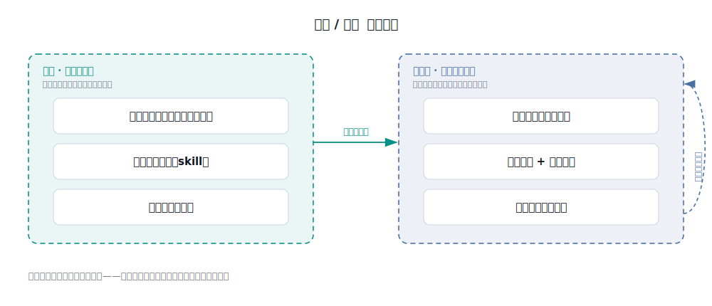

# 提测验证流水线

## 这是什么

研发提测之后、测试通过之前，有一段每次都要做的固定工作：读懂这次改了什么、想清楚要测什么、审一遍代码、把不该上线的挡住、部署到测试环境、跑验证、把结论回写到工作项系统。

这套东西把这段工作用 AI 编排成**一条命令**跑完，并且把每次的判断依据沉淀下来，越用越准。

## 解决什么问题

提测把关长期靠人，于是有三个老毛病：

- **不稳定**：同样的改动，不同的人审、不同的状态审，结论不一样，漏检看运气。
- **漏回归**：逃到生产的缺陷里，很大一部分是"改了 A、碰坏了没人回归的 B"，以及需求本身没写清。
- **经验不沉淀**：谁踩过的坑、什么算对、什么该拦，都在个人脑子里，换人就丢，新人从零踩一遍。

## 难点在哪（这部分我们没有回避）

把 AI 放进质量工作，有一个必须先想清楚的边界：**AI 不是万能，没有哪一环能完全无人化。** 它能扎多深，取决于三件事——这活能不能机械化、有没有明确的"判准"（什么结果才算对）、能不能用硬信号自动验证。

由此暴露两个真正的坎：

- **判准（oracle）缺失**：AI 常常不知道"这个功能到底什么结果才算对"，这是它在质量工作里最薄的一环。看起来对就放过，是最危险的假象。
- **担责不能外包**：放不放行、哪条违反要硬拦上线，是要有人负责的决策，AI 只能给证据、给建议。

想清楚这两点，才知道 AI 该放在哪、不该抢什么。

## 我们的方法

- **一条命令串起七环**：变更分析 → 用例生成 → 代码评审 → 质量门禁 → 部署 → E2E 验证 → 度量落库。遇到要人决策的地方会停下等你。
- **把 AI 放在它能扎最深的地方**：用例设计、代码评审、影响面分析——这几环可机械化、判准相对可得，AI 增益最大；用对抗式复核压掉误报，避免"制造虚假安全感"。
- **判准沉淀成判准库**：把"什么结果才算对"一条条记下来，用例生成定预期、E2E 断言时直接复用，不再每次重猜。
- **引擎与经验两层分离**：流程（引擎）通用不变，项目差异（经验）全落在经验层，随用随长。这是它能跨项目复用的关键。

- **门禁确定性裁决**：每条检查项预先定好严重度，违反 Blocker 项就硬拦，不靠临场主观判断。
- **用数据说话**：过程指标看流水线健康度，逃逸率看质量是否真的变好。

## 怎么落地

照《落地手册》三步走：

1. **拷文件**：把引擎（命令 + skill）、经验层模板、度量工具拷进目标项目。
2. **改绑定**：声明本项目用什么工作项系统、代码平台、浏览器工具，引擎按此对接。
3. **填经验**：从空模板起步，拿真实提测一次次跑，把踩到的坑、确认的判准写回经验层。

别指望一次填满——经验层是靠一次次提测长出来的，这也是它越用越准的原因。

## 里面有什么

- `01-方法论/` —— 为什么值得做、AI 在各环节能扎多深（独立深度地图 + 研发周期框架）
- `02-引擎/` —— 一条命令 + 五个阶段能力 + 并行评审
- `03-经验层-模板/` —— 检查清单、判准库、门禁、工具适配的空结构
- `04-工具/` —— 度量落库、看板、逃逸率复测
- `QA使用手册.md` —— **QA 日常怎么用**：起命令、四个停点、怎么读门禁、怎么回流经验
- `落地手册.md` —— 装配用：拷什么、改什么、怎么用
- `查看.html` —— md 文档查看器（友好阅读）

## 一个前提

引擎靠一个 AI 编码代理（如 Claude Code）在项目里运行——它读改动、审代码、驱动环境、回写工作项系统。命令与 skill 放在代理约定的位置（如 `.claude/`）才能被调用。全程只读代码、写评论、写用例，不提交业务代码、不动主线分支。
