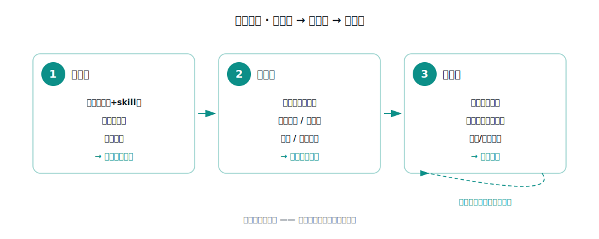

# 落地手册

把这个包落到一个新项目并跑起来，分三步：拷文件、改绑定、填经验。之后是日常使用和看度量。



前提：项目里有一个 AI 编码代理（如 Claude Code），它能读代码、调工作项系统和代码平台、驱动浏览器。命令与 skill 要放在代理约定的位置才能被调用，下面以 Claude Code 的 `.claude/` 为例。

---

## 一、拷文件

从本包拷到目标项目对应位置：

| 本包里的源 | 拷到目标项目 | 说明 |
|-----------|-------------|------|
| `02-引擎/commands/test-intake.md` | `.claude/commands/` | 顶层编排命令 |
| `02-引擎/skills/*` | `.claude/skills/` | 五个阶段能力 |
| `02-引擎/workflows/code-review-parallel.js` | `.claude/workflows/` | 并行评审加速器 |
| `03-经验层-模板/*` | `docs/experience/` | 经验层模板（空结构）。见下方"经验层怎么起步" |
| `04-工具/qa-metrics.py` | `tools/` | 度量工具 |

**经验层怎么起步**：本包的 `03-经验层-模板/` 是空结构——检查清单类目、判准格式、门禁裁决骨架、自我迭代机制都在，具体条目留白。

- 直接拷模板，按你项目的真实情况往里填：平台级坑写进 `platform.md`，每个仓一份 `projects/<仓>.md`（从 `_template.md` 起），漏检的问题补进 `review-rules.md`，确认的判准补进 `oracles.md`。
- 一开始别指望填满。经验层靠一次次提测长出来，这也是工具变准的来源。
- 如果你有权访问某个已填满的内部实现、且业务相近，可以直接继承它再增量调整，省去从零积累。

## 二、改绑定（工具适配层）

引擎里有几处和工具链耦合，换项目要替换。做法：在目标项目建一份 `docs/experience/toolchain.md`，按下面的表声明本项目用什么工具，引擎按它绑定。

先声明这些：

- **工作项系统**：TAPD / Jira / 禅道 / GitHub Issues。要映射四个动作——查工作项、发评论、写用例、关联用例。号码识别规则（纯数字，还是 `PROJ-123`）。
- **代码平台**：GitLab / GitHub / Gitee。映射两个动作——取 MR/PR 变更、分支对比。各仓主分支约定。
- **路由索引**（可选，用于影响面反查）：有就填位置；没有则影响面反查降级为"读被改接口的调用方代码 + 领域文档"。
- **判仓规则**（多仓项目才需要）：判定依据（如"控制器文件路径 + API 路由前缀"双证据）、已知同名歧义。单仓项目跳过。
- **浏览器自动化**：一般是 Playwright。登录方式（账密 / SSO / 验证码需人工）、会话机器能否直连测试环境。
- **部署**（阶段 6）：首期人工闸口（QA 部署后告知就绪）；后续可接运维平台自动触发 + 就绪探测。

对照替换引擎里的耦合点：

| 耦合点 | 示例值 | 换项目改成 |
|--------|-----------|-----------|
| 工作项系统 | 如 TAPD / Jira 的 MCP | 目标系统的 MCP 或 API |
| 代码平台 | 如 GitLab / GitHub 的 MCP | 目标平台对应 |
| 浏览器自动化 | Playwright | 同类，一般不变 |
| 路由索引 | `docs/api-route-index.md` | 目标索引；无则降级读代码 |
| 判仓规则 | 双证据判仓 | 目标规则；单仓可删 |
| 业务领域文档 | `docs/business/` | 目标领域文档；无则跳过 |

原则：引擎文档里凡出现具体工具名之处都是替换点。把抽象描述留着，只换括号里的具体工具。

## 三、填经验（随用随长）

1. `platform.md`：目标平台的架构级通用坑——多租户怎么隔离？权限模型？有没有核心计算引擎？跨仓联动？
2. `projects/`：每个仓或模块一个文件，从 `_template.md` 起。首次可只写"定位"，其余待补。
3. `review-rules.md`、`oracles.md`：拿真实提测跑，把漏检的问题、确认的判准写回来。

别指望一次填满。经验层是靠一次次提测长出来的，这也是工具变准的来源。

---

## 四、日常怎么用

研发提测后，在会话里跑：

```
/test-intake MR=<MR链接 或 仓库+分支>  TAPD=<工作项号>  [ENV=<测试环境> TENANT=<租户> ACCOUNT=<账号>]
```

它按顺序跑七个环节，遇到要你决策的地方会停下：

| 环节 | 做什么 | 停不停 |
|------|--------|--------|
| 变更分析 | 改动 + 影响面 + 回归范围 | — |
| 用例生成 | 多维度用例 + 判准定预期（写回工作项系统前确认） | 确认 |
| 代码评审 | 对照清单白盒审 + 并行复核去误报 + 分级 | — |
| 质量门禁 | 按已签核严重度基线裁决：Blocker 拦 / 仅 Major 提示 | 可覆盖 |
| 部署 | 人工闸口或接运维平台 | — |
| E2E 验证 | 驱动真实环境 + 接口断言 + 留证 | — |
| 汇总 + 度量落库 | 回写工作项系统 + 记一条度量 | — |

日常你只碰这一条命令，中间的评审规则、判准、缺陷模式引擎自己会用。

## 五、怎么看度量

度量分两档：过程指标（每次跑自动记，看流水线健康度）和结果指标（看质量真的变好没）。

```
python3 tools/qa-metrics.py dashboard   # 生成看板
python3 tools/qa-metrics.py report      # 命令行周报
python3 tools/qa-metrics.py escape      # 复测逃逸率，对比落地前基线（需工作项系统 token）
```

看的节奏：每次跑完看这次的评审与门禁结论；每周看趋势、据此调流水线（误报多就收敛规则，拦截率异常就复核门禁）；每个迭代复测一次逃逸率，看改进有没有传导到结果。口径细节见 `04-工具/度量口径.md`。

---

## 落地验收清单

- [ ] `/test-intake` 能识别 MR/分支 + 工作项号
- [ ] 变更分析能拉到 diff 并反查影响面
- [ ] 生成的用例能写回工作项系统
- [ ] 代码评审能出问题清单 + 按基线自动裁决
- [ ] E2E 能登录测试环境并跑通至少一条用例
- [ ] 经验层至少沉淀了一条真实踩坑
- [ ] 度量能落库、能出看板

## 复用粒度

- 同公司不同产品线：引擎与方法论几乎照搬，只改经验层和少量判仓、主分支。
- 不同公司或不同工具链：按第二步换工作项系统与代码平台的绑定，方法论与经验层结构不变。
